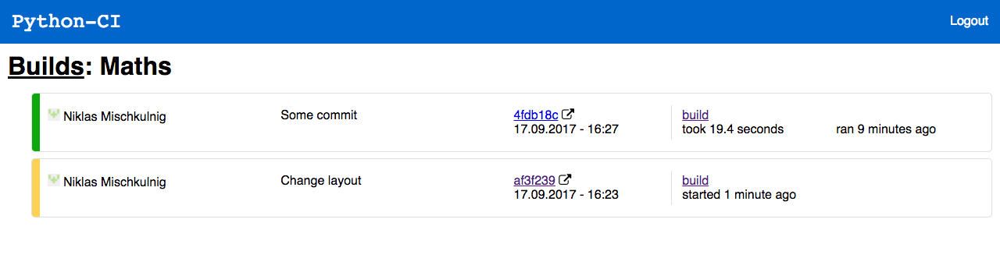
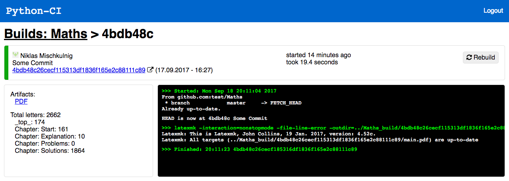

# python-ci

A lightweight CI-server written in python, originally developed for a Raspberry Pi because other existing solutions were to resource-intensive (Jenkins) or cumbersome to use.

- Has a *React*-ive web interface
- Can be set up as a GitHub webhook
- Can display the build status next to the commit on GitHub

## Setup

Clone your source folder next to the script (see below) and make `start.sh` executable (rename it to start.sh if you want). Enviroment variables for the python script serve as configuration:

- `OUTPUT_SUFFIX`: the `_build` below; optional (default: `_build`)
- `SECRET`: the secret from the GitHub webhook configuration; optional
- `JWT_SECRET`: the secret for creating a JWT token
- `PASSWORD`: the password (username is hardcoded: `user`)
- `PROJECT`: comma-seperated string of your projects (e.g. `Maths` or `Maths,Name`)
- Needed to set commit statuses, otherwise optional:
	- `TOKEN`: a GitHub personal access token
	- `DOMAIN`: the URL under which the server is accessible (including `http[s]://`)

You need the following file hierarchy: 

	python-ci
	 |- python-ci.py
	 |- README.md
	 |- [TeXcount_3_0_1]
	 |- ...
	 |- Maths
	 |  - .ci.json
	 |  - Document.tex
	  - Maths_build
	    |- Document.pdf
	    |- Document.aux
	     - ...
(`Maths` and `Document` will serve as example names for the rest of this document)

`.ci.json` is the project's configuration file:

	{
		"language": "latex",
		"main": "Document",
		"stats": ["counts"] <- optional
	}

Currently implemented languages:
- `git`: Update repository only
- `latex`: Update repository and run `latexmk` on the `${main}.tex` file

Currently implemented "stats":
- for `latex`:
	- `counts`: Show `main`'s letter count
	
	
Note:
For the `counts` stats, [TeXcount](http://app.uio.no/ifi/texcount/download.html) options needs to be downloaded to a folder `TeXcount_3_0_1` inside `python-ci`. To count bibliography, `%TC:subst \printbibliography \bibliography` needs to be the first line of your document and you'll have to patch TeXcount (from [here](https://gist.github.com/mischnic/f8b0433934e046c4e6d0202d99276b82)).

## Usage

To run `python-ci.py` in the background and not have it exit when closing the ssh-session, run `nohup ./start.sh &`.

python-ci delivers the following pages: (they accept **only long** commit-hashes)

### Web Interface

The main interface is served unter http://ci.example.com/Maths/

### API

(The following links are only correct, if you use a dedicated webserver as a proxy to python-ci with a configuration as seen below. The python-ci server itself responds to requests like `/Maths/1f2a23..`, without `/api`.)

GET request alternative to a GitHub webhook:
`http://ci.example.com/api/Maths/1f31488cca82ad562eb9ef7e3e85041ddd29a8ff/build`

Get the list of projects (set via `PROJECTS`, see above):
`http://ci.example.com/api/`

The commit-hashes in the following URLs are **optional** (in that case, the files from the last build are used):

Would correspond to the file `Maths_build/Document.pdf`:
`http://ci.example.com/api/Maths/[1f31488cca82ad562eb9ef7e3e85041ddd29a8ff/]pdf`

Returns the compile-log which was saved as `Maths_build/.log`:
`http://ci.example.com/api/Maths/[1f31488cca82ad562eb9ef7e3e85041ddd29a8ff/]log`

Returns a svg-badge indicating the commit-hash of the last build and the build status (successful, error, currently running):
`http://ci.example.com/api/Maths/[1f31488cca82ad562eb9ef7e3e85041ddd29a8ff/]svg` 

Example for a badge which links to the log file:

``

## As a GitHub webhook

As the payload url use: `https://ci.example.com/api/Maths`.

When adding the webhook, be sure to set the "Content type" to `application/json`.

## Server configuration

By default, python-ci listens on `localhost:8000`, meaning that it will only accept connections from the server itself. To reach it you could something like this in your nginx configuration to accept requests from the `ci` subdomain (and serve the React Single-Page App correctly) :

	server {
		listen 80;
	
		# listen 443 ssl;
		# ssl_certificate ...
		
		root <<Path to the react build/ folder>>;
	
		server_name	ci.example.com;
		
		location / {
			try_files $uri /index.html;
		}

		location /api {
			rewrite ^/api(.*) $1 break;
			proxy_pass http://localhost:8000;
		}
	}

If your router doesn't support [NAT loopback](https://en.wikipedia.org/wiki/NAT_loopback) alias [Hairpinning](https://en.wikipedia.org/wiki/Hairpinning) (meaning that trying to access `ci.example.com` in the same network as the server causes a `ERR_CONNECTION_REFUSED`) then you have to add `ci.example.com*` to the `server_name` directive. This enables you to access the server under `ci.example.com.192.168.0.2.nip.io` with `192.168.0.2` being the IP of the server in your local network.

If you only want the api and webhook without the web interface, then you don't need a seperate webserver. In that case, change `'localhost'` in [this](https://github.com/mischnic/python-ci/blob/b5d7e55e94ac528c41a8e30fe6297d768cb244d9/python-ci.py#L323) line to `''`, so the server will be reachable not only from localhost. (i.e. via `192.168.0.4:8000/Maths/svg`)

