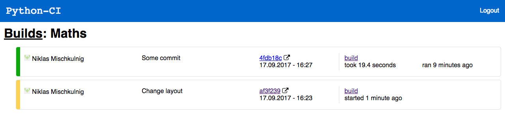
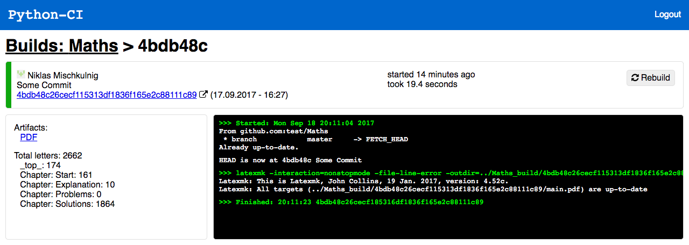

# python-ci

A lightweight CI-server written in python, originally developed for a Raspberry Pi because other existing solutions were to resource-intensive (Jenkins) or cumbersome to use.

- Has a *React*-ive web interface
- Can be set up as a GitHub webhook
- Can display the build status next to the commit on GitHub

Drawbacks:

- Builds aren't fully isolated, the same cloned repo is `reset` to the corresponding commit and then used for building.
- For an `npm` build, `npm build` is run and then the specified build folder is `zip`ped up.

## Setup

- tested with Python 3.5 and 3.6
- install required libs: `pip3 install -r requirements.txt`

Clone your source folder next to the script (see below), copy `start.sh.in` to `start.sh` and make `start.sh` executable. Enviroment variables in `start.sh` for the python script serve as configuration:

- `OUTPUT_SUFFIX`: the `_build` below; optional (default: `_build`)
- `SECRET`: the secret from the GitHub webhook configuration; optional
- `JWT_SECRET`: the secret for creating a JWT token
- `PASSWORD`: the password (username is hardcoded: `user`)
- `PROJECT`: comma-seperated string of your projects (project folders) (e.g. `Maths` or `Maths,Name`)
- `NGINX_ACCEL`: set to any value to use nginx's `X-Accel-Redirect` for build files
- `CI_PATH`: additional `PATH` entries to set when executing commands (e.g `/Library/TeX/texbin` on macOS)
- Needed to set commit statuses, otherwise optional:
	- `TOKEN`: a GitHub personal access token
	- `URL`: the URL under which the server is accessible (including `http[s]://`)

If you get the error `Permission denied (publickey)` during build, and a line for your private key in `~/.ssh/config`: `IdentityFile ~/.ssh/your_key_name` and uncomment the corresponding section in `start.sh`

To install python-ci as a systemd service, run `./install-service.sh`, this will configure the service and enable it. Then you can use commands like:

- `sudo systemctl start/stop/restart python-ci` to start/stop/restart the server
- `sudo systemctl enable/disable python-ci` to enable/disable the autostart on boot

You need the following file hierarchy: (clone your project like `Maths`)

	python-ci
	 |- build
	   |- Maths
	      |- .git
	      |- .ci.json
	      | - Document.tex
	   |- Maths_build
	      |- Document.pdf
	      |- Document.aux
	     - ...
	 |- README.md
	 |- src
	 |- [TeXcount_3_1]
	 |- ...
(`Maths` and `Document` will serve as example names for the rest of this document)

`.ci.json` is the project's configuration file:

	{
		"language": "latex",
		"main": "Document",
		"stats": ["counts"] // optional
	}

Currently implemented languages:
- `git`: Update repository only
- `latex`: Update repository and run `latexmk` on the `${main}.tex` file
- `npm`: Update repository, run `yarn install` and `yarn build` (with env variables specified in the `env` dict) in the `source` folder, excepts output in the `source`/`output` folder and packages the content into a zip file.

Currently implemented "stats":
- for `latex`:
	- `counts`: Show `main`'s letter count
	
	
Note:
The `counts` stats options needs [TeXcount](http://app.uio.no/ifi/texcount/download.html) to be downloaded to a folder `TeXcount_3_1` inside `python-ci`. To count bibliography, `%TC:subst \printbibliography \bibliography` needs to be the first line of your document and you'll have to patch TeXcount (from [here](https://gist.github.com/mischnic/f8b0433934e046c4e6d0202d99276b82)).

## Usage

To run `python-ci.py` in the background (have it exit when closing the terminal) without using systemd: `nohup ./start.sh &`.

python-ci delivers the following pages: (they accept **only long** commit-hashes)

### Web Interface

With the configuration below, the web interface is served at `ci.example.com`.

### API

(The following links are only correct, if you use a dedicated webserver as a proxy to python-ci with a configuration as seen below. The python-ci server itself responds to requests like `/Maths/1f2a23..`, without `/api`.)

- All API requests except for the last listed here need a JWT token either specified as a GET parameter (`...?token=eyJhbGciOiJIUz...`) or as a  header: `Authentification: Bearer eyJhbGciOiJIUz...`.
- The commit-hashes in URLs can generally be replaced by `latest`

| Desc | URL | Request data | Response data | 
| ---- | --- | ------------ | ------------- |
| Login| `POST /api/login` | json: `{username: "user", password: "pass"}` | text: `jwt token...` |
| Build| `GET /api/<proj>/<sha:not"latest">/build` | - | status code: 200 OK, 503 Busy |
| List projects| `GET /api/` | - | json: `["Maths", "test"]` |
| PDF build artifact| `GET /api/<proj>/<ref>/pdf` | - | `main.pdf` |
| Compile log | `GET /api/<proj>/<ref>/log` | - | `.log` |
| Badge | `GET /api/<proj>/<ref>/svg` | - |  |
| Badge | `GET /api/<proj>/latest/svg` | - (no auth. needed) |  |

Example for a badge which links to the log file:

``

## As a GitHub webhook

Payload URL: `https://ci.example.com/api/Maths`.

When adding the webhook, be sure to set the "Content type" to `application/json`. Only the `push` (and `ping` event) event is handled.

## Server configuration

By default, python-ci listens on `localhost:8000`, meaning that it will only accept connections from the server itself. To reach it you could something like this in your nginx configuration to accept requests from the `ci` subdomain (and serve the React Single-Page App correctly) :

	server {
		listen 80;
	
		# listen 443 ssl;
		# ssl_certificate ...
		
		root <<Path to the react build/ folder>>;
	
		server_name	ci.example.com;
		
		location / {
			try_files $uri /index.html;
		}

		location /api {
			rewrite ^/api(.*) $1 break;
			proxy_pass http://localhost:8000;
			
			proxy_set_header Host $host;
			proxy_set_header X-Real-IP $remote_addr;
			proxy_set_header X-Forwarded-For $proxy_add_x_forwarded_for;
			proxy_set_header X-Forwarded-Proto $scheme;
		}
	}

If your router doesn't support [NAT loopback](https://en.wikipedia.org/wiki/NAT_loopback) alias [Hairpinning](https://en.wikipedia.org/wiki/Hairpinning) (meaning that trying to access `ci.example.com` in the same network as the server causes a `ERR_CONNECTION_REFUSED`) then you have to add `ci.example.com*` to the `server_name` directive. This enables you to access the server under `ci.example.com.192.168.0.2.nip.io` with `192.168.0.2` being the IP of the server in your local network.

To use nginx to send your build files add the following inside the `server` block and set `NGINX_ACCEL` to any value in your `start.sh` file:

	location /data/ {
		internal;
		alias /path/to/python-ci/;
	}

If you only want the api and webhook without the web interface, then you don't need a seperate webserver. In that case, change `'localhost'` in [this](https://github.com/mischnic/python-ci/blob/b5d7e55e94ac528c41a8e30fe6297d768cb244d9/python-ci.py#L323) line to `''`, so the server will be reachable not only from localhost. (i.e. via `192.168.0.4:8000/Maths/svg`)

