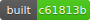

# python-ci

A lightweight CI-server written in python, originally developed for a Raspberry Pi because other existing solutions were to resource-intensive (Jenkins) or cumbersome to use.

- Can be set up as a GitHub webhook
- Can display the build status of a commit in the GitHub web interface!

## Setup

Clone your source folder next to the script (see below) and make `start.sh` executable (rename it to start.sh if you wish). Enviroment variables for the python script serve as configuration:

- `OUTPUT_SUFFIX`: the `_build` below; optional (default: `_build`)
- `SECRET`: the secret from the GitHub webhook configuration; optional
- Needed to set commit statuses, otherwise optional:
	- `Token`: a GitHub personal access token
	- `DOMAIN`: the URL under which the server is accessible (including `http[s]://`)

You need the following file hierarchy:

	python-ci
	 |- python-ci.py
	 |- README.md
	 |- ...
	 |- Maths
	 |  - .ci.json
	 |  - Document.tex
	  - Maths_build
	    |- Document.pdf
	    |- Document.aux
	     - ...
		 

`.ci.json` is the project's configuration file:

	{
		"language": "latex",
		"main": "Document"
	}

Currently implemented languages:
- `git`: Update repostory only
- `latex`: Update repository and run `latexmk` on the `${main}.tex` file

## Usage

python-ci delivers the following pages: (they accept **only long** commit-hashes)

GET request alternative to a GitHub webhook:
`http://ci.example.com/1f31488cca82ad562eb9ef7e3e85041ddd29a8ff/build`
  
The commit-hashes in the following URLs are **optional**:

Would correspond to the file `Maths_build/Document.pdf`:
`http://ci.example.com/[1f31488cca82ad562eb9ef7e3e85041ddd29a8ff/]pdf`
  
Returns the compile-log which was saved as `Maths_build/_Document.log`:
`http://ci.example.com/[1f31488cca82ad562eb9ef7e3e85041ddd29a8ff/]log`
  
Returns a svg-badge indicating the commit-hash of the last build and the build status (successful, error, currently running):
`http://ci.example.com/[1f31488cca82ad562eb9ef7e3e85041ddd29a8ff/]svg` 
  
Example for a badge which links to the log file: 
``

## As a GitHub webhook

When adding the webhook, be sure to set the "Content type" to `application/json` in the GitHub web-interface.

## Server configuration

By default, python-ci listens on `localhost:8000`, meaning that it will only accept connections from the server itself. To reach it anyway you could something like this in your nginx configuration to accept requests from the `ci` subdomain:

	server {
		listen 80;
	
		# listen 443 ssl;
		# ssl_certificate ...
	
		server_name	ci.example.com;
	
		location / {
			proxy_pass http://localhost:8000;
		}
	}

If your router doesn't support [NAT loopback](https://en.wikipedia.org/wiki/NAT_loopback) alias [Hairpinning](https://en.wikipedia.org/wiki/Hairpinning) (meaning that trying to access `ci.example.com` in the same network as the server causes a `ERR_CONNECTION_REFUSED`) then you have to add `ci.example.com*` to the `server_name` directive. This enables you to access the server under `ci.example.com.192.168.0.2.nip.io` with `192.168.0.2` being the IP of the server in your local network.

